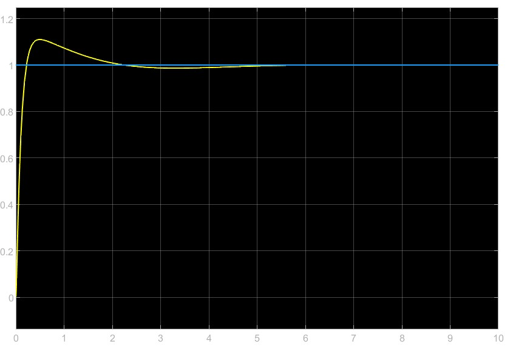

## Approach to Control Design

In any system/plant, to maintain a certain target reference level we need a controller to feed necessary input into the actuator. Controllers work on a feedback loop which measures the deviation of true output with the expected output, and tries to maintain true output level close to the reference output level. The most common type of controller is the PID (Proportional-Derivative_Integral) controller.
 
Transfer functions are functions typically in Laplace domain which relate input to output in a plant. They are representative of nature of a physical system.

---

## Problem Statement

### Simplified Inverted Pendulum Control

Problem Statement : 
 
To derive transfer function of a simplified model of an Inverted Pendulum, and implement a block diagram of the same in Simulink.
In an Inverted Pendulum, the goal is to maintain the pendulum at a certain position, which is often an unstable equilibrium. To keep the pendulum stable at the position, we must implement a controller which modulates the current input according to our needs. 

 
We formulated a mathematical model to represent the dynamics of the Inverted Pendulum. Using this model, we derived the differential equation and subsequently the transfer function.
 
τ(s) = 1/(s^2 + k)
 
where k is a constant depending on the mass, length and torque constant of the motor
 
 

 

 
 

**Pulak & Aditya**.
